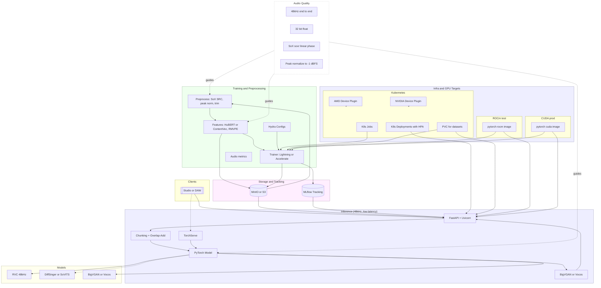
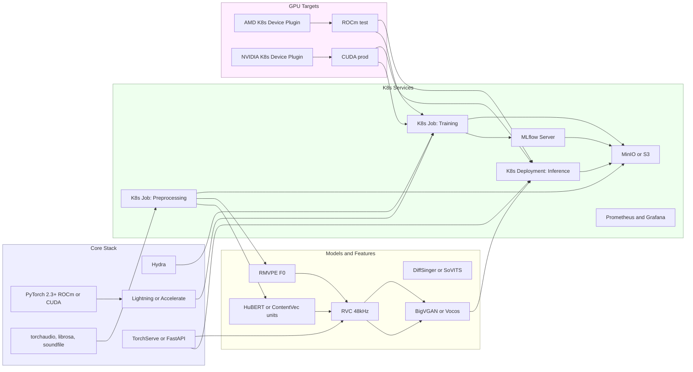

# rocktop

This is the monorepo for the "rocktop" vocal model training/inference system's various core functions and supporting systems. The readme will be updated as development progresses, pretty much nothing is implemented. After multiple years of using various singing model inference platforms and being unsatisfied with the lack of free, transparent options available it became clear an open source, flexible, extensible offering was needed. Firstly for personal use, secondarily for whomever may need this toolset.

The software is free to use under the GPLv3 licence but models trained may carry copyrights from the source vocalist, do your business right. 

Below are initial renders of the core flow and stack flow for ease of reference.

## Architecture Diagrams

### Core Flow

### Core Stack

## Platforms

- Deploy target: Ubuntu Server LTS (pinned to 24.04 in CI runners).
- CI tests: Linux (Ubuntu 22.04), macOS, and Windows for portability.

## Local Dev Quickstart (Python 3.11)

1. Ensure Python 3.11, install uv (optional) and pre-commit:
   - pip install pre-commit
   - pre-commit install
2. Run linters/tests locally:
   - ruff check . && black --check . && codespell
   - mypy src servers/rocktop_mcp
   - pytest -q
3. Run the inference stub:
   - uvicorn app.infer:app --host 0.0.0.0 --port 8080
4. Generate SBOMs locally (optional):
   - syft . -o spdx-json > sbom-repo.spdx.json
   - syft . -o cyclonedx-json > sbom-repo.cdx.json

See AGENTS.md for architecture and environment details.

## Data Prep Scripts

- Resample to 48 kHz float32 (linear-phase, very high quality SRC):
  - scripts/sox_resample.sh raw_audio data/processed
- Peak normalize to −1 dBFS:
  - scripts/sox_normalize.sh data/processed data/normalized

Make targets (uses uv where applicable):
- make fmt | make lint | make type | make test
- make sbom-repo | make trivy-fs
- make serve | make mcp-smoke
- make sox-resample IN=raw_audio OUT=data/processed
- make sox-normalize IN=data/processed OUT=data/normalized

## CI Overview

- Lint/Format: Ruff, Black, Codespell
- Typing: mypy
- Tests: pytest (skips if none)
- Security: Gitleaks, Bandit, pip-audit (blocking)
- SBOMs: Syft (repo SPDX + CycloneDX), Syft (image SPDX + CycloneDX)
- Scanning: Trivy filesystem (always), Trivy image (on image build)
- Docker hygiene: Hadolint
- Kubernetes: kubeconform, kube-linter, OPA/Conftest policies
- Images: Buildx build, GHCR push on main/master, Cosign sign + SBOM attest
- Workflows use concurrency to cancel superseded runs
